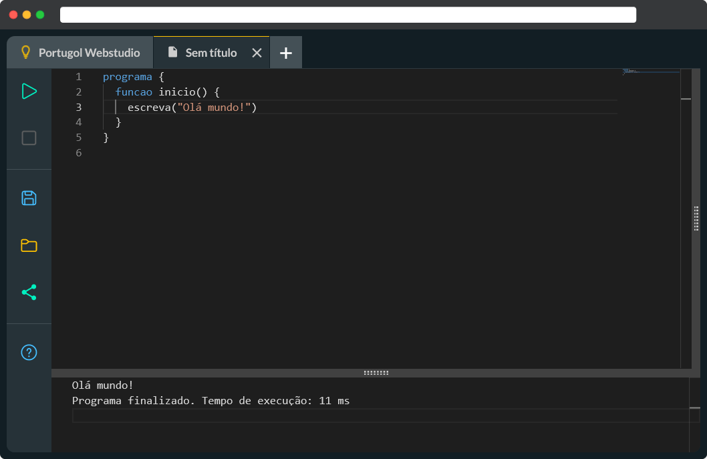

<a href="https://dgadelha.github.io/Portugol-Webstudio/"></a>

# Portugol Webstudio

_IDE online para o Portugol_

[](https://github.com/dgadelha/Portugol-Webstudio/blob/master/LICENSE)
[](https://github.com/dgadelha/Portugol-Webstudio/stargazers)

Baseado no Portugol Studio, o **Portugol Webstudio** tenta trazer todo ambiente de desenvolvimento que é possível se encontrar no desktop, para a internet. Ele constitui-se de um ambiente de desenvolvimento construído para permitir a criação e a execução dos programas escritos em Portugol, trazendo assim uma experiência o mais próxima do que você pode encontrar da IDE do Portugol Studio. Portugol, também conhecido como Português estruturado, é um pseudocódigo escrito em português.

[](https://dgadelha.github.io/Portugol-Webstudio/)

## Características

- Suporta abertura e escrita de arquivos `.por`
- Permite editar e executar múltiplos códigos ao mesmo tempo
- Executado no console original do Portugol com interação em tempo real
- Interface simples e idêntica ao Portugol Studio
- Código executado diretamente no navegador através de Web Workers

## Estrutura do projeto

O Portugol Webstudio é um projeto que utiliza o framework [Angular](https://angular.io/), [RxJS](https://rxjs.dev/) e [antlr4ts](https://github.com/tunnelvisionlabs/antlr4ts). Ele é dividido em 6 pacotes (disponíveis na pasta `packages`):

- `@portugol-webstudio/antlr`: Pacote que contém a gramática do Portugol e a geração do parser, lexer e visitor
- `@portugol-webstudio/ide`: Pacote que contém a interface do usuário
- `@portugol-webstudio/parser`: Pacote que contém o novo parser do Portugol, que recebe uma árvore pré-processada pelo ANTLR e a transforma em uma árvore semântica
- `@portugol-webstudio/resources`: Pacote que contém os recursos do Portugol, como os exemplos e a seção de ajuda
- `@portugol-webstudio/runner`: Pacote que executa o código gerado pelo transpilador em Web Workers, tratando entrada, saída, erros e eventos.
- `@portugol-webstudio/runtime`: Pacote que contém o transpilador de Portugol para JavaScript e o código de execução em _runtime_ necessário: variáveis, bibliotecas, etc.

## Executando o código localmente

1. Certifique-se de possuir instalado o [Node.js LTS](https://nodejs.org/pt-br/download/)

2. Instale as dependências do projeto

```sh
npm ci
```

3. Compile os pacotes:

```sh
npm run build
```

4. Inicie o servidor de desenvolvimento:

```sh
npm start
```

Após isto, você poderá acessar a IDE em: [http://localhost:4200](http://localhost:4200)

## Contribuidores

- [Douglas Gadêlha](https://github.com/dgadelha)
- [Danilo Gadêlha](https://github.com/dngadelha)
- [Laboratório de Inovação Tecnológica na Educação (LITE) da Universidade do Vale do Itajaí (UNIVALI)](https://github.com/UNIVALI-LITE)

## Sobre o Projeto

**Autores:** [Douglas Gadêlha](mailto:dgadelha@live.com) e [Danilo Gadêlha](mailto:dngadelha@outlook.com)

## Licença

    Portugol Webstudio - IDE online para o Portugol
    Copyright (C) 2023  Douglas Gadêlha, Danilo Gadêlha e contribuidores

    This program is free software: you can redistribute it and/or modify
    it under the terms of the GNU General Public License as published by
    the Free Software Foundation, either version 3 of the License, or
    (at your option) any later version.

    This program is distributed in the hope that it will be useful,
    but WITHOUT ANY WARRANTY; without even the implied warranty of
    MERCHANTABILITY or FITNESS FOR A PARTICULAR PURPOSE.  See the
    GNU General Public License for more details.

    You should have received a copy of the GNU General Public License
    along with this program.  If not, see <http://www.gnu.org/licenses/>.
