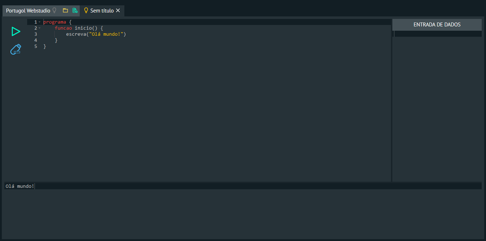

# Portugol Webstudio 
IDE online para o Portugol (UNIVALI)

## Como funciona?
É criado um Ambiente de Desenvolvimento Integrado virtual no navegador (para isso, usamos algumas bibliotecas como ax5ui-layout e Ace), que torna possível a criação e edição de arquivos no formato Portugol.

Quando o usuário clica o botão Executar (Play), o código digitado é enviado via AJAX para o servidor, que irá executar o **Portugol-Console**, inserir a _Entrada de Dados_ do usuário, coletar a saída, enviar para o navegador e então exibir na tela.

## Bibliotecas Utilizadas
- [Ace](https://ace.c9.io/) para o Editor de Código
- [ax5ui-layout](http://ax5.io/ax5ui-layout/) para o Layout do IDE
- [Blob.js](https://github.com/bjornstar/blob-polyfill) para baixar/salvar o código digitado
- [Bootstrap](https://getbootstrap.com/) para os Grids responsivos
- [FileSaver.js](https://github.com/eligrey/FileSaver.js) para baixar/salvar o código digitado
- [jQuery](https://jquery.com/) para diminuir a dor de cabeça
- [JSMin](https://github.com/mrclay/minify/blob/2.x/min/lib/JSMin.php) (modificado para Portugol) para gerar um "hash" do código e diminuir o trabalho do servidor
- [Portugol-Console](https://github.com/UNIVALI-LITE/Portugol-Console) [(modificado com saída limpa / UTF-8)](https://github.com/dgadelha/Portugol-Console) para executar o código inserido pelo usuário
- [Portugol-Nucleo](https://github.com/UNIVALI-LITE/Portugol-Nucleo) [(modificado para UTF-8)](https://github.com/dgadelha/Portugol-Nucleo) - necessário para o Portugol-Console
- [Slim 2](https://docs.slimframework.com/) para facilitar a vida
- [text-encoding](https://github.com/inexorabletash/text-encoding) para converter a codificação usada por padrão nos arquivos **.por** de ISO-8859-1 para UTF-8

## Contribuidores
- [Douglas Gadêlha](https://github.com/dgadelha)
- [Alisson Steffens](https://github.com/AlissonSteffens)
- [Laboratório de Inovação Tecnológica na Educação (LITE) da Universidade do Vale do Itajaí (UNIVALI)](https://github.com/UNIVALI-LITE)

## Sobre o Projeto
Este projeto foi criado graças ao Programa Institucional de Bolsa de Iniciação à Docência (Pibid), programa da Coordenação de Aperfeiçoamento de Pessoal de Nível Superior (CAPES), fundação vinculada ao Ministério da Educação (MEC).

**Autor:** [Douglas Gadêlha Souza Silva](mailto:douglas.gadelha@ifba.edu.br)

**Orientador:** [Douglas Xavier Teodoro de Oliveira](mailto:douglasteodoro@ifba.edu.br)

**Instituição:** [Instituto Federal de Educação, Ciência e Tecnologia da Bahia (IFBA) - Campus Porto Seguro](http://portoseguro.ifba.edu.br/)

## Licença
    Portugol Webstudio - IDE online para o Portugol (UNIVALI)
    Copyright (C) 2016  Douglas Gadêlha / Ministério da Educação (MEC)

    This program is free software: you can redistribute it and/or modify
    it under the terms of the GNU General Public License as published by
    the Free Software Foundation, either version 3 of the License, or
    (at your option) any later version.

    This program is distributed in the hope that it will be useful,
    but WITHOUT ANY WARRANTY; without even the implied warranty of
    MERCHANTABILITY or FITNESS FOR A PARTICULAR PURPOSE.  See the
    GNU General Public License for more details.

    You should have received a copy of the GNU General Public License
    along with this program.  If not, see <http://www.gnu.org/licenses/>.
