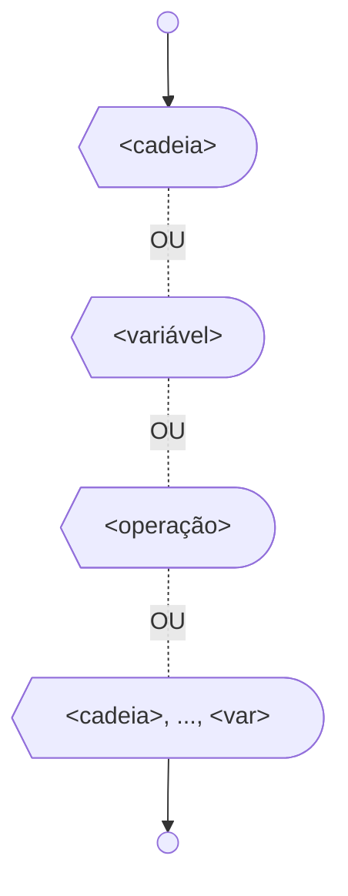

# Escreva

Em determinadas situações precisamos mostrar ao usuário do programa alguma informação. Para isso, existe um comando na programação que exibe dados ao usuário. No Portugol a instrução de saída de dados para a tela é chamada de "escreva", pois segue a ideia de que o algoritmo está escrevendo dados na tela do computador.

O comando escreva é utilizado quando se deseja mostrar informações no console da IDE, ou seja, é um comando de saída de dados.

Para utilizar o comando escreva, você deverá escrever este comando e entre parênteses colocar a(s) variável(eis) ou texto que você quer mostrar no console. Lembrando que quando você utilizar textos, o texto deve estar entre aspas. A sintaxe para utilização deste comando está demonstrada a seguir:

```portugol sintaxe title="Exemplo de Sintaxe"
escreva("Escreva o texto a ser digitado aqui")
```

O fluxograma abaixo ilustra as diversas formas de se exibir valores na tela com o comando escreva.



Note que quando queremos exibir o valor de alguma variável não utilizamos as aspas. Para exibição de várias mensagens em sequência, basta separá-las com vírgulas.

Existem duas ferramentas importantes que auxiliam a organização e visualização de textos exibidos na tela. São elas: o quebra-linha e a tabulação.

O quebra-linha é utilizado para inserir uma nova linha aos textos digitados. Sem ele, os textos seriam exibidos um ao lado do outro. Para utilizar este comando, basta inserir "\\n". O comando de tabulação é utilizado para inserir espaços maiores entre os textos digitados. Para utilizar este comando, basta inserir "\\t".

O exemplo a seguir ilustra em Portugol o mesmo algoritmo do fluxograma acima, bem como a utilização do quebra-linha e da tabulação.

```portugol exemplo title="Exemplo"
programa {
  funcao inicio() {
    inteiro variavel = 5

    // Escreve no console um texto qualquer
    escreva("Escreva um texto aqui.\n")

    // Escreve no console o valor da variável "variavel"
    escreva(variavel, "\n")

    // Escreve no console o resultado da operação
    escreva(variavel + variavel, "\n")

    // Escreve no console o texto digitado, e o valor contido na variável
    escreva("O valor da variável é: ", variavel)

    // Escreve no console o texto com quebra de linha
    escreva("Texto com\n", "quebra-linha")

    // Escreve no console o texto com espaço de tabulação
    escreva("Texto com\t tabulação")
  }
}
```
