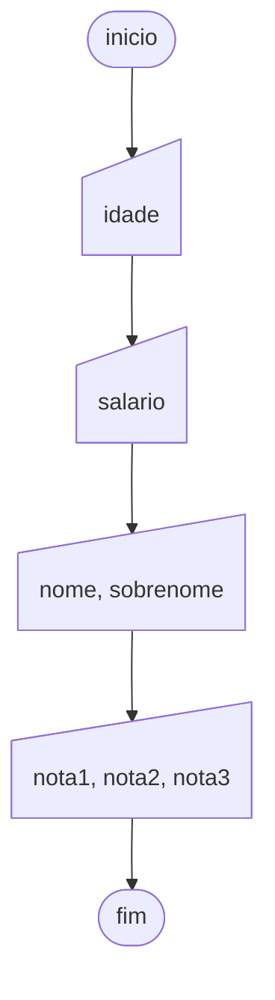

# Leia

Em alguns problemas, precisamos que o usuário digite um valor a ser armazenado. Por exemplo, se quisermos elaborar um algoritmo para calcular a média de nota dos alunos, precisaremos que o usuário informe ao algoritmo quais as suas notas. No Portugol a instrução de entrada de dados via teclado é chamada de "leia", pois segue a ideia de que o algoritmo está lendo dados do ambiente externo (usuário) para poder utilizá-los.

O comando leia é utilizado quando se deseja obter informações do teclado do computador, ou seja, é um comando de entrada de dados. Esse comando aguarda um valor a ser digitado e o atribui diretamente na variável.

Para utilizar o comando leia, você deverá escrever este comando e entre parênteses colocar a(s) variável(eis) que você quer que recebam os valores a serem digitados. A sintaxe deste comando está exemplificada a seguir:

```portugol sintaxe title="Exemplo de Sintaxe"
inteiro x
cadeia y
real z

// Chamando o comando leia
leia(x)
leia(y, z)
// No final as variáveis irão possuir o valor digitado pelo usuário.
```

Note que para armazenar um valor em uma variável, é necessário que a mesma já tenha sido declarada anteriormente. Assim como no comando escreva, se quisermos que o usuário entre com dados sucessivos, basta separar as variáveis dentro dos parênteses com vírgula.

O fluxograma abaixo ilustra um algoritmo que lê as variáveis: idade, salario, nome, sobrenome, nota1, nota2 e nota3.



O exemplo a seguir ilustra em Portugol o mesmo algoritmo do fluxograma acima.

```portugol exemplo title="Exemplo"
programa {
  funcao inicio() {
    inteiro idade
    real salario, nota1, nota2, nota3
    cadeia nome, sobrenome

    escreva("Informe a sua idade: ")
    leia(idade) // Lê o valor digitado para "idade"

    escreva("Informe seu salario: ")
    leia(salario) // Lê o valor digitado para "salario"

    escreva("Informe o seu nome e sobrenome: ")
    leia(nome, sobrenome) // Lê o valor digitado para "nome" e "sobrenome"

    escreva("Informe as suas três notas: ")
    leia(nota1, nota2, nota3) // Lê o valor digitado para "nota1", "nota2" e "nota3"

    escreva("Seu nome é:" + nome + " " + sobrenome + "\n")
    escreva("Você tem " + idade + " anos e ganha de salario " + salario + "\n")
    escreva("Suas três notas foram:\n")
    escreva("Nota 1: " + nota1 + "\n")
    escreva("Nota 2: " + nota2 + "\n")
    escreva("Nota 3: " + nota3 + "\n")
  }
}
```
