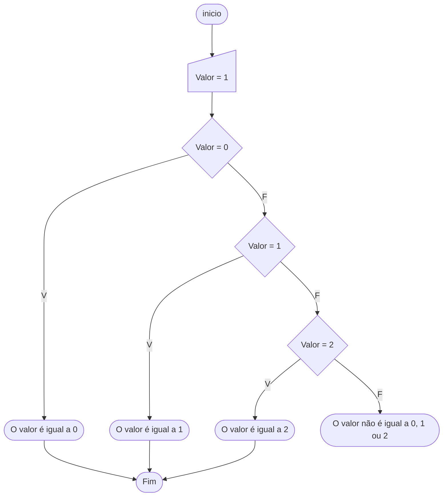

# Escolha-caso

Qual a melhor forma para programar um menu de, por exemplo, uma calculadora? Esta tarefa poderia ser executada através de desvios condicionais `se` e `senão`, porém esta solução seria complexa e demorada. Pode-se executar esta tarefa de uma maneira melhor, através de outro tipo de desvio condicional: o `escolha` junto com o `caso`. Este comando é similar aos comandos `se` e `senão`, e reduz a complexidade do problema.

Apesar de suas similaridades com o `se`, ele possui algumas diferenças. Neste comando não é possível o uso de operadores lógicos, ele apenas trabalha com valores definidos, ou o valor é igual ou diferente. Além disto, o `escolha` e o `caso` têm alguns casos de teste, e se a instrução `pare` não for colocada ao fim de cada um destes testes, o comando executará todos os casos seguintes.

A sintaxe do `escolha` é, respectivamente, o comando `escolha`, a condição a ser testada entre parênteses e, entre chaves, os casos.

A sintaxe para se criar um caso é a palavra reservada `caso`, o valor que a condição testada deve possuir, dois pontos e suas instruções. Lembre-se de terminá-las com o comando `pare`.

```portugol sintaxe title="Exemplo de Sintaxe"
inteiro numero
leia(numero)
escolha (numero) {
  caso 1:
    // Instruções caso o número seja igual a 1
    pare

  caso 2:
    // Instruções caso o número seja igual a 2
    pare

  caso 50:
    // Instruções caso o número seja igual a 50
    pare

  caso contrario:
    // Instruções caso nenhum dos casos anteriores seja verdadeiro
}

caracter simbolo
leia(simbolo)
escolha (simbolo) {
  caso 's':
    // Instruções caso o caracter seja igual a 's'
    pare

  caso '[':
    // Instruções caso o caracter seja igual a '['
    pare

  caso '*':
    // Instruções caso o caracter seja igual a '*'
}
```

O comando `pare` evita que os blocos de comando seguintes sejam executados por engano. O `caso contrario` será executado se nenhum dos casos anteriores for satisfeito.

A figura a seguir ilustra um algoritmo que verifica se a variável valor é igual a 0, 1 ou 2.



O exemplo a seguir ilustra em Portugol o mesmo algoritmo do fluxograma acima.

```portugol exemplo title="Exemplo"
programa {
  funcao inicio() {
    inteiro valor = 1
    escolha (valor) {
      caso 0: // Testa se o valor é igual a 0
        escreva("o valor é igual a 0")
        pare

      caso 1: // Testa se o valor é igual a 1
        escreva("o valor é igual a 1")
        pare

      caso 2: // Testa se o valor é igual a 2
        escreva("o valor é igual a 2")
        pare

      caso contrario:
        escreva("o valor não é igual a 0, 1 ou 2")
    }
  }
}
```
