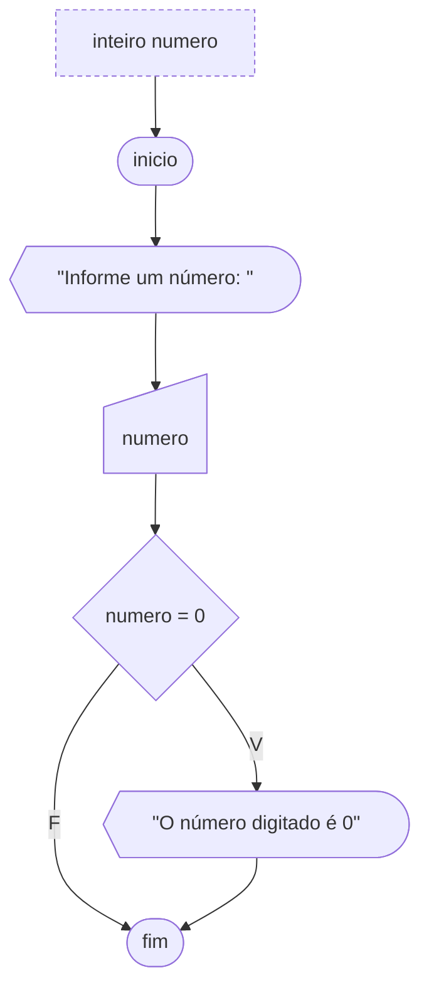

# Se

Aqui veremos como dizer a um algoritmo quando um conjunto de instruções deve ser executado. Esta determinação é estabelecida se uma condição for verdadeira. Mas o que seria esta condição? Ao executar um teste lógico teremos como resultado um valor verdadeiro ou falso. A condição descrita anteriormente nada mais é que um teste lógico.

Se este teste lógico resultar verdadeiro, as instruções definidas dentro do desvio condicional serão executadas. Se o teste for falso, o algoritmo pulará o trecho e continuará sua execução a partir do ponto onde o desvio condicional foi finalizado.

O desvio condicional que foi acima apresentado é considerado simples e conhecido como o comando `se`.

A sintaxe é respectivamente a palavra reservada `se`, a condição a ser testada entre parênteses e as instruções que devem ser executadas entre chaves caso o desvio seja verdadeiro.

```portugol sintaxe title="Exemplo de Sintaxe"
logico condicao = verdadeiro
se (condicao) {
  // Instruções a serem executadas se o desvio for verdadeiro
}

inteiro x = 5
se (x > 3) {
  // Instruções a serem executadas se o desvio for verdadeiro
}
```

A figura abaixo ilustra um algoritmo que verifica se o número digitado pelo usuário é zero. Ele faz isso usando um desvio condicional. Note que se o teste for verdadeiro exibirá uma mensagem, no caso falso nenhuma ação é realizada.



O exemplo a seguir ilustra em Portugol o mesmo algoritmo do fluxograma acima.

```portugol exemplo title="Exemplo"
programa {
  funcao inicio() {
    inteiro num

    escreva("Digite um número: ")
    leia(num)

    se (num == 0) {
      escreva("O número digitado é 0")
    }
  }
}
```
