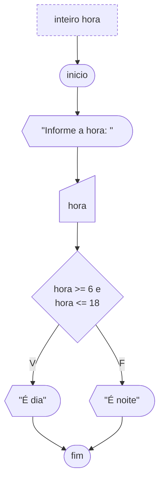

# Se-senao

Agora vamos imaginar que se a condição for falsa um outro conjunto de comandos deve ser executado. Quando iremos encontrar esta situação?

Imagine um programa onde um aluno com média final igual ou maior a 6 é aprovado. Se quisermos construir um algoritmo onde após calculada a média, seja mostrada na tela uma mensagem indicando se o aluno foi aprovado ou reprovado. Como fazer isto? Utilizando o comando `se` junto com o `senao`.

Sua sintaxe é simples, basta, no término do comando `se`, ao lado do fechamento de chaves, colocar o comando `senao` e, entre chaves, as instruções a serem executadas caso a condição do `se` seja falsa.

```portugol sintaxe title="Exemplo de Sintaxe"
logico condicao = falso
se (condicao) {
  // Instruções a serem executadas se o desvio for verdadeiro
} senao {
  // Instruções a serem executadas se o desvio for falso
}
```



O exemplo a seguir ilustra em Portugol o mesmo algoritmo do fluxograma acima.

```portugol exemplo title="Exemplo"
programa {
  funcao inicio() {
    inteiro hora

    escreva("Digite a hora: ")
    leia(hora)

    se (hora >= 6 e hora <= 18) {
      escreva("É dia")
    } senao {
      escreva("É noite")
    }
  }
}
```
