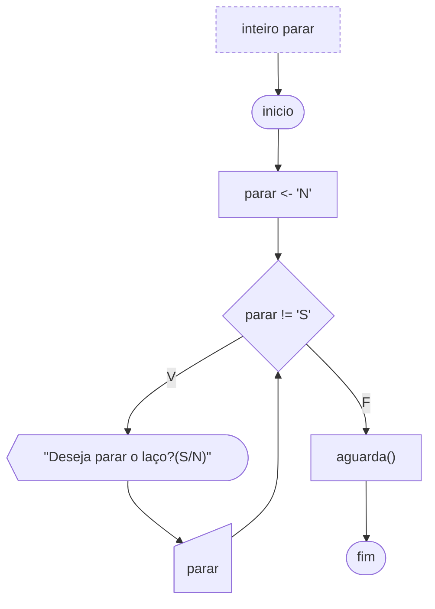

# Laço Enquanto (Pré-Testado)

Se fosse necessário a elaboração de um jogo, como por exemplo um jogo da velha, e enquanto houvesse lugares disponíveis no tabuleiro, este jogo devesse continuar, como faríamos para que o algoritmo tivesse este comportamento? É simples. O comando `enquanto` poderia fazer esse teste lógico. A função do comando `enquanto` é: executar uma lista de comandos enquanto uma determinada condição for verdadeira.

A sintaxe é respectivamente a palavra reservada `enquanto`, a condição a ser testada entre parênteses, e entre chaves a lista de instruções que se deseja executar.

```portugol sintaxe title="Exemplo de Sintaxe"
logico condicao = verdadeiro
enquanto (condicao) {
  // Executa as instruções dentro do laço enquanto a condição for verdadeira
}
```

A figura abaixo ilustra um algoritmo que verifica uma variável do tipo `caracter`. Enquanto a variável for diferente da letra ‘S’ o comando `enquanto` será executado, assim como as instruções dentro dele. No momento em que o usuário atribuir ‘S’ à variável, o comando enquanto terminará e o programa chega ao seu final.



O exemplo a seguir ilustra em Portugol o mesmo algoritmo do fluxograma acima.

```portugol exemplo title="Exemplo"
programa {
  funcao inicio() {
    caracter parar
    parar = 'N'

    enquanto (parar != 'S') {
      escreva("deseja parar o laço? (S/N)")
      leia(parar)
    }
  }
}
```
