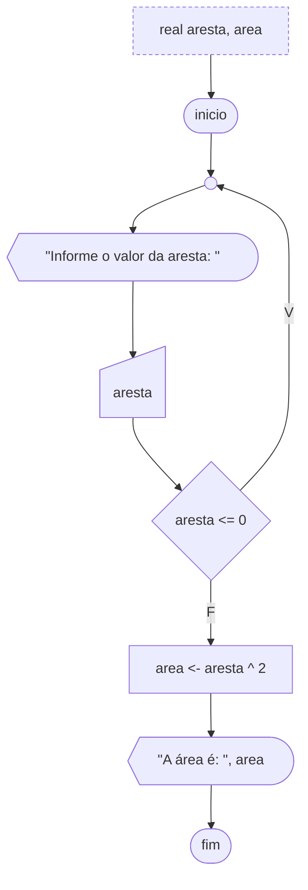

# Laço Faça-Enquanto (Pós-Testado)

Em algumas situações, faz-se necessário verificar se uma condição é verdadeira ou não após uma entrada de dados do usuário. Para situações como essa, podemos usar o laço de repetição faca-enquanto. Este teste é bem parecido com o enquanto. A diferença está no fato de que o teste lógico é realizado no final, e com isso as instruções do laço sempre serão realizadas pelo menos uma vez. O teste verifica se elas devem ser repetidas ou não.

A sintaxe é respectivamente a palavra reservada `faca`, entre chaves as instruções a serem executadas, a palavra reservada `enquanto` e entre parênteses a condição a ser testada.

```portugol sintaxe title="Exemplo de Sintaxe"
logico condicao = verdadeiro
faca {
  // Executa os comandos pelo menos uma vez, e continua executando enquanto a condição for verdadeira
} enquanto (condicao)
```

A figura abaixo ilustra um algoritmo que calcula a área de um quadrado. Note que para o cálculo da área é necessário que o valor digitado pelo usuário para aresta seja maior que 0. Caso o usuário informe um valor menor ou igual a 0 para a aresta, o programa repete o comando pedindo para que o usuário entre novamente com um valor para a aresta. Caso seja um valor válido, o programa continua sua execução normalmente e ao fim exibe a área do quadrado.



```portugol exemplo title="Exemplo"
programa {
  funcao inicio() {
    real aresta, area

    faca {
      escreva("Informe o valor da aresta: ")
      leia(aresta)
    } enquanto (aresta <= 0)

    area = aresta * aresta
    escreva("A área é: ", area)
  }
}
```
