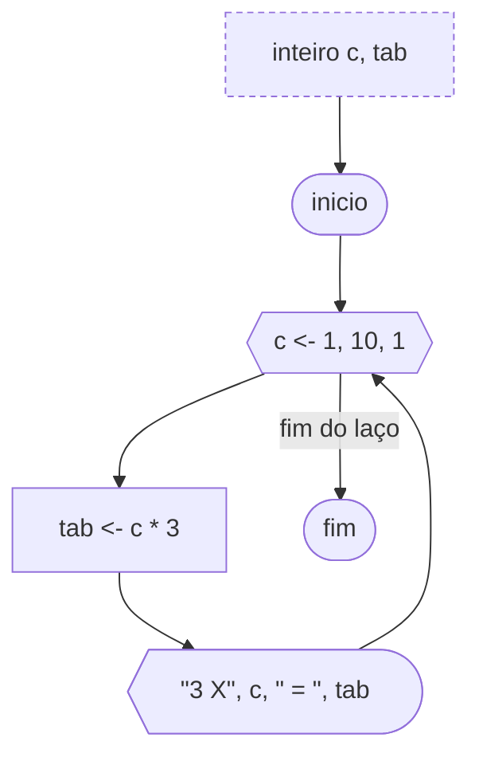

# Laço Para (Com Variável de Controle)

E se houver um problema em que seja necessário um número determinado de repetições? Por exemplo, se quiséssemos pedir ao usuário que digitasse 10 valores. Poderíamos utilizar a instrução `leia` repetidas vezes. Porém se ao invés de 10 valores precisássemos de 100, essa tarefa se tornaria muito extensa. Para resolver problemas como esse, podemos usar um laço de repetição com variável de controle. No Portugol, ele é conhecido como `para`.

O laço de repetição com variável de controle facilita a construção de algoritmos com número definido de repetições, pois possui um contador (variável de controle) embutido no comando com o incremento automático. Desta forma, um erro muito comum que se comete ao esquecer de fazer o incremento do contador é evitado. Toda vez que temos um problema cuja solução necessita de um número determinado de repetições utilizamos um contador. O contador deve ser inicializado antes do laço e deve ser incrementado dentro do laço.

O laço com variável de controle possui três partes. A inicialização da variável contadora, a definição do valor final do contador e a definição do incremento. Estas três partes são escritas juntas, no início do laço.

A sintaxe é respectivamente a palavra reservada `para`, abre parênteses, a declaração de uma variável de controle, ponto e vírgula, a condição a ser testada, ponto e vírgula, uma alteração na variável de controle a ser feita a cada iteração, fecha parênteses, e entre chaves as instruções do programa.

```portugol sintaxe title="Exemplo de Sintaxe"
para (inteiro i = 0; i < 8; i++) {
  // Código a ser executado enquanto a condição for satisfeita.
}
```

A figura abaixo ilustra um algoritmo que exibe na tela a tabuada de 3. Note que conforme a sintaxe mostrada anteriormente, a primeira instrução do laço é inicializar o contador c=1. O segundo comando especifica a condição para que o laço continue a ser executado, ou seja, enquanto o contador c for menor ou igual a 10. Por último, a terceira instrução demonstra que o contador c será acrescentado em 1 em seu valor a cada iteração do comando. O laço será executado 10 vezes e mostrará a tabuada de 3.



O exemplo a seguir ilustra em Portugol o mesmo algoritmo do fluxograma acima.

```portugol exemplo title="Exemplo"
programa {
  funcao inicio() {
    inteiro tab

    para (inteiro c = 1; c <= 10; c++) {
      tab = c * 3
      escreva("3 x ", c, " = ", tab, "\n")
    }
  }
}
```
