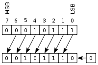
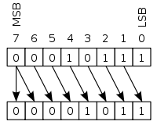

# Operação de Bitwise Shift

Os operadores de Bitwise Shift são utilizados para deslocar bits de um número inteiro para direita ou para a esquerda.

## Left Shift

Em um deslocamento aritmético à esquerda, os bits são deslocados para a esquerda e zeros são acrescentados à direita como demonstra a imagem:



Sua sintaxe é, respectivamente, o valor inteiro, o operador '<<' e o número de bits a ser deslocado.

```portugol sintaxe title="Exemplo de Sintaxe"
/*
Para se fazer a operação Bitwise 23 << 1
00010111 (decimal +23)
LEFT-SHIFT uma vez
--------
00101110 (decimal +46)
 */
inteiro resultado = 23 << 1
```

O número de bits a ser deslocado equivale à quantidade de vezes que o valor será multiplicado por 2.

## Right Shift

Em um deslocamento aritmético para a direita, o bit de sinal é deslocado da esquerda, preservando, assim, o sinal do operando como demonstra a imagem:



Sua sintaxe é, respectivamente, o valor inteiro, o operador '>>' e o número de bits a ser deslocado.

```portugol sintaxe title="Exemplo de Sintaxe"
/*
Para se fazer a operação Bitwise -105 >> 1
10010111 (decimal -105)
RIGHT-SHIFT uma vez
--------
11001011 (decimal -53)
 */
inteiro resultado = -105 >> 1
```

O número de bits a ser deslocado equivale à quantidade de vezes que o valor será dividido por 2, sempre resultando em um valor inteiro.

## Tabela de compatibilidade de tipos da operação de Bitwise SHIFT

| Operando Esquerdo | Operando Direito | Tipo Resultado | Exemplo   | Resultado |
| ----------------- | ---------------- | -------------- | --------- | --------- |
| `inteiro`         | `inteiro`        | `inteiro`      | `12 >> 2` | `3`       |
| `inteiro`         | `inteiro`        | `inteiro`      | `12 << 2` | `48`      |

O exemplo a seguir ilustra em Portugol os mesmos exemplos usados anteriormente.

```portugol exemplo title="Exemplo"
programa {
  funcao inicio() {
    escreva(23 << 1, "\n", -105 >> 1)
  }
}
```
